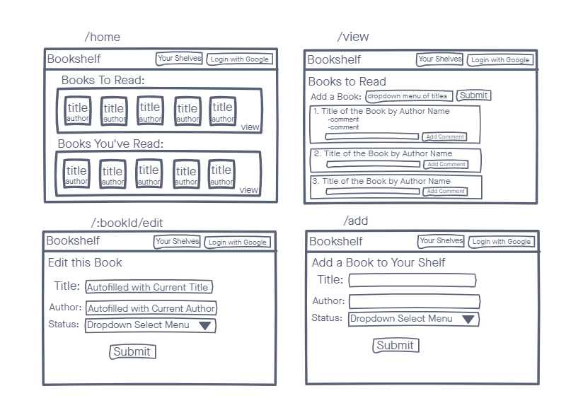
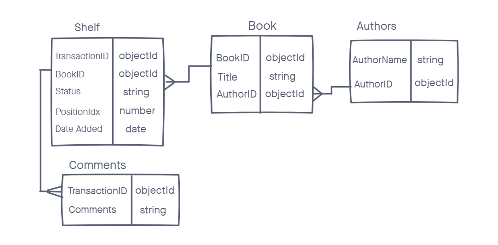

# Stacks

A web app that allows a user to add and organize books in their virtual library.

## Technologies
- Node.js
- Express
- HTML5
- CSS3
- JavaScript
- jQuery
- MongoDB
- Mongoose

## Screenshots

## Getting Started
[Click here](https://book-stacks-app.herokuapp.com/) to get started. Login with Google and start adding books to your shelves!

## Future Enhancements
- Add ability to change order in which books appear on shelves
- Add ability to see other user's shelves